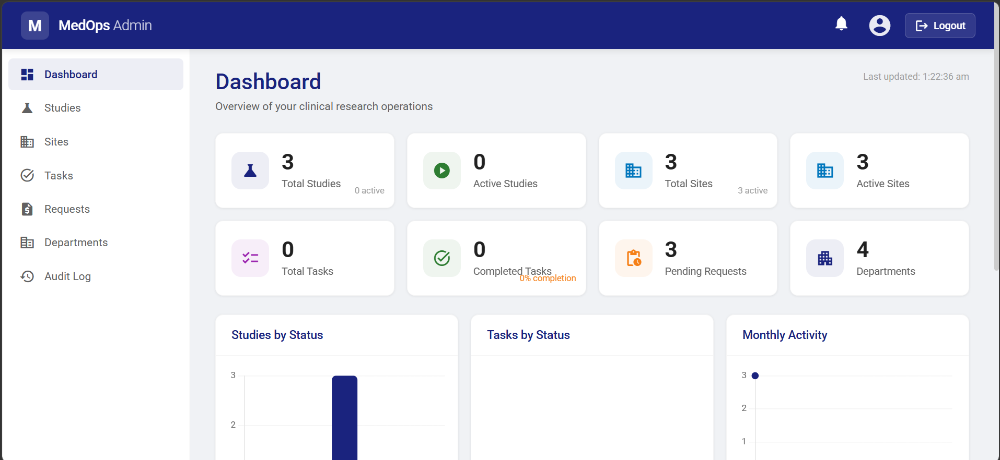
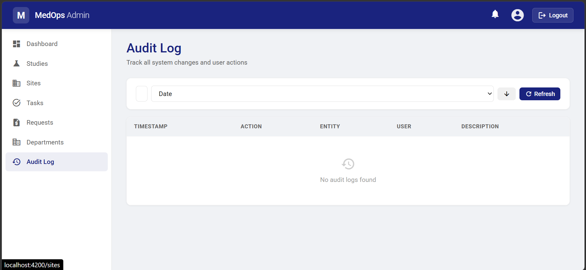
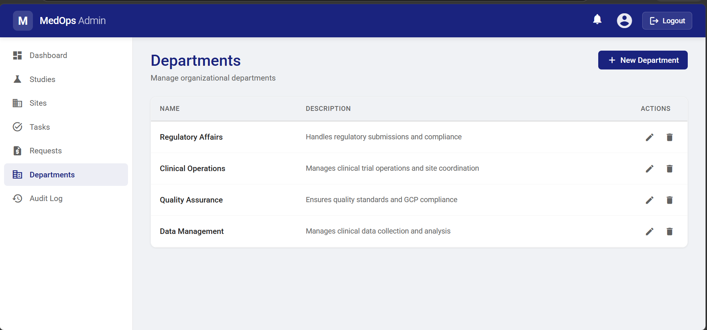
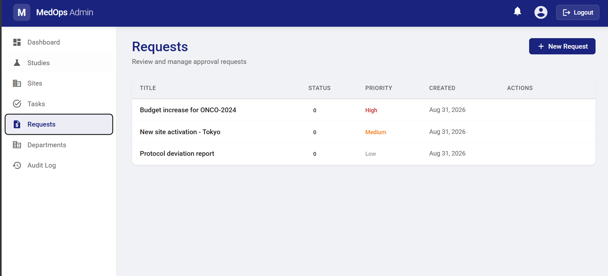
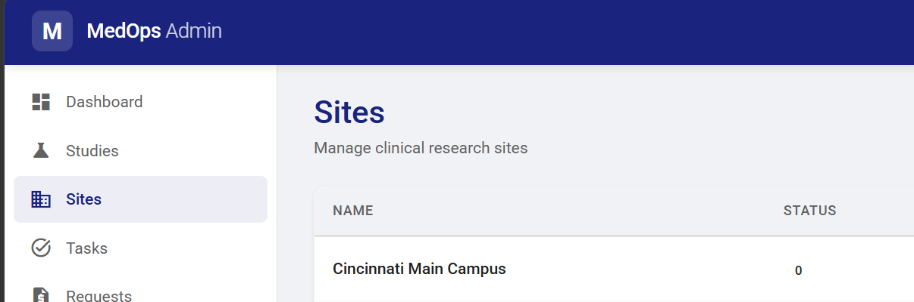

# MedOps Admin Platform

Enterprise clinical trial management platform demonstrating modernization of a legacy application into a secure, maintainable, testable, and cloud-ready system.

## Screenshots

| Dashboard | Studies Management |
|-----------|-------------------|
|  |  |

| Sites Management | Tasks & Notifications |
|------------------|----------------------|
|  |  |

| Requests | Departments |
|----------|-------------|
|  |  |

| Audit Log |
|-----------|
|  |

## Tech Stack

| Layer | Technology |
|-------|-----------|
| Frontend | Angular 22 (standalone components, signals, lazy-loaded routes) |
| Backend | ASP.NET Core 10 Web API + GraphQL (HotChocolate) + SignalR |
| ORM | Entity Framework Core 10 (SQLite) |
| Auth | ASP.NET Core Identity + JWT Bearer |
| Caching | Redis (StackExchange.Redis) |
| Storage | Azure Blob Storage, Azure Table Storage, Local File Storage |
| Real-time | SignalR for live notifications |
| Charts | Chart.js for dashboard analytics |
| Logging | Serilog (Console + File sinks) |
| Testing | xUnit, Moq, FluentAssertions, InMemory EF Core |
| Container | Docker + Docker Compose |
| CI/CD | Azure Pipelines |

## Features

### Core Functionality
- **Studies Management** — Create, edit, activate, complete, suspend, terminate clinical studies
- **Sites Management** — Manage research sites with addresses, contacts, and activation status
- **Tasks Management** — Create, assign, track tasks with priorities and status workflow
- **Requests Management** — Submit, approve, reject approval requests with priority levels
- **Departments** — Manage organizational departments

### Platform Features
- **Real-time Dashboard** — KPI cards, Chart.js bar/doughnut/line charts, activity feed, overdue items
- **Audit Logging** — Track all entity changes with old/new values, searchable and sortable
- **Notification System** — In-app notifications with bell indicator, mark read/unread
- **Activity Feed** — Real-time user activity tracking across the platform
- **File Attachments** — Upload/download files attached to any entity
- **Comment System** — Add comments on studies, tasks, requests, sites
- **User Management** — Profile management, role-based access (Admin/User)
- **Search & Filtering** — Server-side search, sort, and pagination on all list views
- **Real-time Updates** — SignalR hub for live notification push

## Solution Structure

```
MedOps.slnx
src/
  MedOps.Domain/          - Entities, Enums, Value Objects, Exceptions, Interfaces
  MedOps.Application/     - DTOs, Validators (FluentValidation), Service Interfaces, Common (PaginatedResult)
  MedOps.Infrastructure/  - EF Core DbContext, Repositories, Services (Audit, Notification, Comment, File, Dashboard)
  MedOps.Contracts/       - Shared Events, Service Contracts
  MedOps.Api/             - Web API Controllers, GraphQL, SignalR Hub, Middleware, Program.cs
tests/
  MedOps.UnitTests/       - Domain, Validator, Service unit tests (34 tests)
  MedOps.IntegrationTests/- EF Core InMemory repository/service tests (10 tests)
  MedOps.ApiTests/        - WebApplicationFactory API tests (2 tests)
frontend/
  medops-web/             - Angular 22 SPA (Dashboard, Studies, Sites, Tasks, Requests, Departments, Audit Log)
```

## Quick Start

### Docker (recommended)
```bash
docker-compose up --build
```
API available at `http://localhost:5000`, Swagger at `http://localhost:5000/swagger`

### Local Development
```bash
# Backend
dotnet restore
dotnet build
dotnet test
dotnet run --project src/MedOps.Api

# Frontend
cd frontend/medops-web
npm install
ng serve
```
Frontend at `http://localhost:4200`, API at `http://localhost:5271`

### Default Credentials
- **Email:** `admin@medops.com`
- **Password:** `Admin@123`

## API Endpoints

| Method | Endpoint | Description |
|--------|----------|-------------|
| **Auth** | | |
| POST | `/api/auth/register` | Register new user |
| POST | `/api/auth/login` | Login (returns JWT) |
| **Studies** | | |
| GET | `/api/studies` | List all studies |
| POST | `/api/studies` | Create study |
| GET | `/api/studies/{id}` | Get study by ID |
| PUT | `/api/studies/{id}` | Update study |
| POST | `/api/studies/{id}/activate` | Activate study |
| POST | `/api/studies/{id}/complete` | Complete study |
| POST | `/api/studies/{id}/suspend` | Suspend study |
| POST | `/api/studies/{id}/terminate` | Terminate study |
| DELETE | `/api/studies/{id}` | Delete study |
| **Sites** | | |
| GET | `/api/sites` | List all sites |
| POST | `/api/sites` | Create site |
| PUT | `/api/sites/{id}` | Update site |
| POST | `/api/sites/{id}/activate` | Activate site |
| POST | `/api/sites/{id}/deactivate` | Deactivate site |
| DELETE | `/api/sites/{id}` | Delete site |
| **Tasks** | | |
| GET | `/api/tasks` | List all tasks |
| POST | `/api/tasks` | Create task |
| PUT | `/api/tasks/{id}` | Update task |
| POST | `/api/tasks/{id}/start` | Start task |
| POST | `/api/tasks/{id}/complete` | Complete task |
| POST | `/api/tasks/{id}/cancel` | Cancel task |
| DELETE | `/api/tasks/{id}` | Delete task |
| **Requests** | | |
| GET | `/api/requests` | List all requests |
| POST | `/api/requests` | Create request |
| POST | `/api/requests/{id}/approve` | Approve request |
| POST | `/api/requests/{id}/reject` | Reject request |
| POST | `/api/requests/{id}/cancel` | Cancel request |
| DELETE | `/api/requests/{id}` | Delete request |
| **Departments** | | |
| GET | `/api/departments` | List all departments |
| POST | `/api/departments` | Create department |
| PUT | `/api/departments/{id}` | Update department |
| DELETE | `/api/departments/{id}` | Delete department |
| **Dashboard** | | |
| GET | `/api/dashboard` | Dashboard data (KPIs, charts, activity) |
| GET | `/api/dashboard/activity` | Recent activity feed |
| **Notifications** | | |
| GET | `/api/notifications` | Get user notifications |
| GET | `/api/notifications/unread-count` | Get unread count |
| POST | `/api/notifications/{id}/read` | Mark as read |
| POST | `/api/notifications/read-all` | Mark all as read |
| **Comments** | | |
| GET | `/api/comments/{entityType}/{entityId}` | Get comments |
| POST | `/api/comments/{entityType}/{entityId}` | Add comment |
| PUT | `/api/comments/{id}` | Update comment |
| DELETE | `/api/comments/{id}` | Delete comment |
| **Files** | | |
| GET | `/api/files/{entityType}/{entityId}` | List attachments |
| POST | `/api/files/{entityType}/{entityId}` | Upload file |
| GET | `/api/files/download/{id}` | Download file |
| DELETE | `/api/files/{id}` | Delete file |
| **Audit** | | |
| GET | `/api/audit` | Get audit logs (searchable, paginated) |
| GET | `/api/audit/{entityType}/{entityId}` | Get entity audit history |
| **User** | | |
| GET | `/api/user/profile` | Get current user profile |
| PUT | `/api/user/profile` | Update profile |
| GET | `/api/user/all` | List all users |
| **Other** | | |
| GET | `/health` | Health check |
| WS | `/hubs/notifications` | SignalR notification hub |
| GET | `/graphql` | GraphQL endpoint |
| GET | `/swagger` | Swagger UI |

## Testing

```bash
dotnet test --verbosity normal
```

- **34 unit tests**: Domain entities, FluentValidation validators, service logic with mocked repositories
- **10 integration tests**: EF Core InMemory database repository and service integration tests
- **2 API tests**: WebApplicationFactory-based health check and endpoint tests
